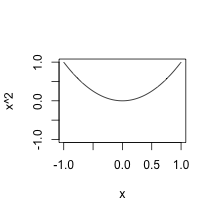

Facial expressions influence our feelings
========================================================
author: J Pettersson
date: 24 Oct 2015
font-family: 'Helvetica Neue'

Darwin Quote 
========================================================
title: False 
type: prompt
transition: zoom
>_"The free expression by outward signs of an emotion intensifies it. On the other hand, the repression, as far as this is possible, of all outward signs softens our emotions..._    
###  ...Even the simulation of an emotion tends to arouse it in our minds"
\- Charles Darwin, 1872   

That includes simple sketchy versions of faces
========================================================
transition: rotate
incremental: true

* Like these   


Functions as mouth expressions
========================================================
title: TRUE
transition: rotate
* $x^2$ for smile   

```r
curve(x^2, xlim=c(-1,1), ylim=c(-1,1))
```

 
   
***
* $-x^2$ for frown   

```r
curve(-x^2, xlim=c(-1,1), ylim=c(-1,1))
```

 

Adjusting X - Try it your self
========================================================
transition: zoom
transition-speed: fast
 

* $0.5x^2$ will give you a sligthly less smiley mouth
* [Try out if the simualtion of an expression tends to arouse it in **your** mind](https://jesperps.shinyapps.io/SmileyFace)
